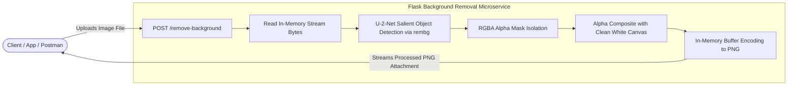

# 🖼️ AI Image Background Removal API

[](https://www.python.org/)
[](https://flask.palletsprojects.com/)
[-orange)](https://github.com/danielgatis/rembg)
[-green)](https://python-pillow.org/)
[](https://vercel.com/)
[](LICENSE)

A high-performance, lightweight REST API for automated image background removal powered by Deep Learning (`rembg` / U-2-Net neural network) and Python's Pillow (`PIL`) image processing library. Built with Flask and fully optimized for both local server hosting and serverless deployment on Vercel.

---

## 🌟 Core Concept & Problem Solved

Removing image backgrounds manually using photo editors is time-consuming, expensive, and difficult to scale across e-commerce catalogs, profile pictures, and product asset pipelines. 

**This project solves that by offering a turnkey microservice that:**
1. Accepts raw image uploads (PNG, JPEG, WebP, etc.) via a clean HTTP `multipart/form-data` endpoint.
2. Employs deep learning salient object detection (`U-2-Net`) to generate a pixel-accurate foreground mask.
3. Automatically isolates foreground subjects and composites them seamlessly onto a clean white canvas.
4. Streams the resulting high-resolution PNG image directly back to the client via in-memory byte buffers (`io.BytesIO`) without temporary disk overhead.

---

## 🏗️ Architecture & Workflow



---

## ✨ Features

- **🧠 Deep Learning Precision**: Leverages pre-trained U-2-Net models for state-of-the-art foreground/background segmentation even on complex hair, furs, and edges.
- **⚡ In-Memory Processing**: Operates entirely in memory via `io.BytesIO`, ensuring zero disk I/O bottlenecks and maximum execution speed.
- **🎨 Clean Compositing**: Converts RGBA output into an optimized RGB PNG composited over a clean white background suitable for product listings and ID photos.
- **☁️ Serverless Ready**: Comes configured with `vercel.json` for zero-configuration serverless deployment using `@vercel/python`.
- **🛡️ Robust Error Handling**: Provides clear status headers (`X-Status`, `X-Message`) and informative JSON error payloads for missing files or invalid data.

---

## 🛠️ Tech Stack

| Component | Technology | Description |
| :--- | :--- | :--- |
| **Language** | Python 3.8+ | Core runtime language |
| **Web Framework** | [Flask](https://flask.palletsprojects.com/) | Lightweight WSGI web application framework |
| **AI / ML Model** | [rembg](https://github.com/danielgatis/rembg) | Deep learning background removal tool built on U-2-Net |
| **Image Processing** | [Pillow (PIL)](https://python-pillow.org/) | Alpha composition, format conversion, and image synthesis |
| **Deployment Engine** | [Vercel](https://vercel.com/) | Serverless Python function runtime |

---

## 📁 Repository Structure

```
flask_background_removal/
├── .env.example        # Environment variable template
├── .gitignore          # Git exclusion rules for environments and temporary files
├── app.py              # Flask server, routing, and image processing pipeline
├── requirements.txt    # Python dependencies
├── vercel.json         # Vercel serverless build and routing configuration
└── README.md           # Project documentation
```

---

## 🚀 Getting Started

### Prerequisites

- **Python 3.8+** installed on your system
- **pip** package manager
- (Optional) **Virtualenv** for isolated environment management

### 1. Clone the Repository

```bash
git clone https://github.com/himanshu-0807/flask_background_removal.git
cd flask_background_removal
```

### 2. Create and Activate a Virtual Environment

```bash
# On macOS / Linux
python3 -m venv venv
source venv/bin/activate

# On Windows
python -m venv venv
venv\Scripts\activate
```

### 3. Install Dependencies

```bash
pip install --upgrade pip
pip install -r requirements.txt
```

> **Note:** When running for the first time, `rembg` will automatically download the pre-trained `u2net.onnx` model weights (~170 MB) to `~/.u2net/`.

### 4. Run the Local Server

```bash
python app.py
```

The server will start at `http://localhost:5000` (or `http://0.0.0.0:5000`).

---

## 📡 API Reference

### 1. Health & Welcome Check

Returns a welcome message and API usage guidance.

- **URL:** `/`
- **Method:** `GET`
- **Response:** `200 OK` (HTML)

```html
<h1>Welcome to the Background Removal API</h1>
<p>Use the <code>/remove-background</code> endpoint to remove the background from an image.</p>
<p>Send a POST request with the image file in the <code>file</code> field.</p>
```

---

### 2. Remove Background

Processes the input image, removes the background, and returns the modified image.

- **URL:** `/remove-background`
- **Method:** `POST`
- **Content-Type:** `multipart/form-data`
- **Request Body:**
  | Field | Type | Required | Description |
  | :--- | :--- | :--- | :--- |
  | `file` | File (Binary) | Yes | Image file (`.png`, `.jpg`, `.jpeg`, `.webp`) |

#### Response Headers:
- `Content-Type: image/png`
- `Content-Disposition: attachment; filename=output.png`
- `X-Status: API running successfully`
- `X-Message: Background removed successfully`

#### Error Responses:
- **`400 Bad Request`**: Missing file or no file selected.
  ```json
  {
    "error": "No file part in the request"
  }
  ```
- **`500 Internal Server Error`**: Processing or conversion failure.
  ```json
  {
    "error": "An error occurred during processing"
  }
  ```

---

## 💻 Usage Examples

### cURL

```bash
curl -X POST "http://localhost:5000/remove-background" \
  -F "file=@/path/to/your/input_image.jpg" \
  --output output.png
```

### Python (`requests`)

```python
import requests

url = "http://localhost:5000/remove-background"
files = {'file': open('input_image.jpg', 'rb')}

response = requests.post(url, files=files)

if response.status_code == 200:
    with open('output_no_bg.png', 'wb') as f:
        f.write(response.content)
    print("Background removed successfully and saved to output_no_bg.png")
else:
    print(f"Error: {response.json()}")
```

### JavaScript / Fetch

```javascript
const formData = new FormData();
formData.append('file', fileInputElement.files[0]);

fetch('http://localhost:5000/remove-background', {
  method: 'POST',
  body: formData,
})
  .then((response) => response.blob())
  .then((blob) => {
    const imageUrl = URL.createObjectURL(blob);
    const img = document.createElement('img');
    img.src = imageUrl;
    document.body.appendChild(img);
  })
  .catch((error) => console.error('Error:', error));
```

---

## ☁️ Deploying to Vercel

This repository includes `vercel.json` for direct deployment on Vercel:

1. Install the Vercel CLI:
   ```bash
   npm i -g vercel
   ```
2. Deploy directly from the project directory:
   ```bash
   vercel
   ```
3. Follow the CLI prompts to deploy your serverless background removal API.

---

## 📄 License

This project is open-source and available under the [MIT License](LICENSE).
